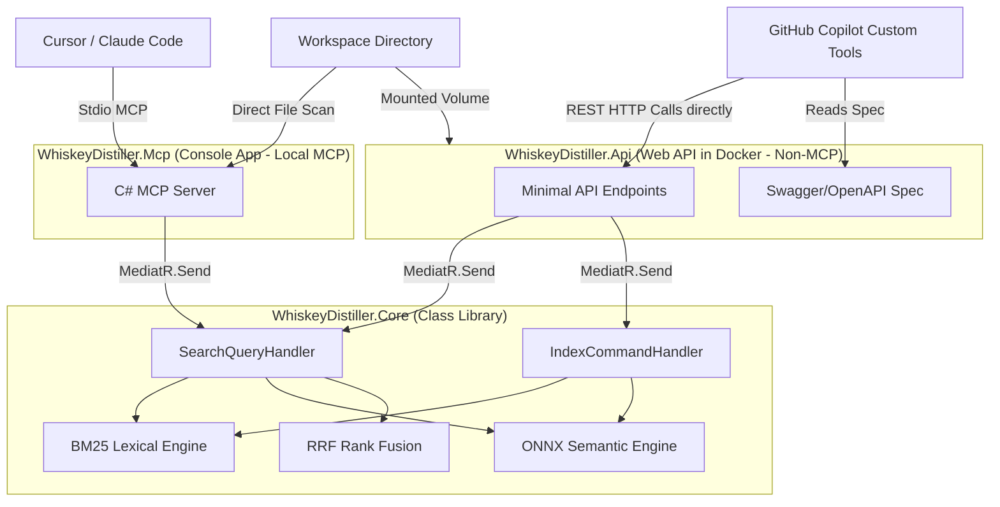

# WhiskeyDistiller: Hybrid Code Search Engine (C#/.NET 10)

[](#)
[](#)
[](#)
[](#)

**WhiskeyDistiller** is a high-performance, lightweight, and local hybrid code search engine written in C#/.NET 10.0. Inspired by MinishLab's Semble, it integrates **BM25 lexical search** with **ONNX-based semantic embeddings** using Reciprocal Rank Fusion (RRF) to retrieve highly relevant code chunks while saving **up to 95%+ in token usage** compared to naive grep-and-read workflows.

WhiskeyDistiller exposes the search engine via two distinct presentations:
1.  **Model Context Protocol (MCP) Server**: A standard stdio-based JSON-RPC server for local coding assistants (Cursor, Claude Code, etc.).
2.  **Dockerized REST API**: A containerized ASP.NET Web API generating OpenAPI (Swagger) specifications that instances of **GitHub Copilot Custom Tools** can query directly (bypassing local MCP restrictions).

---

## Key Features

*   **Hybrid Search Engine**: Fuses BM25 lexical token matching with local ONNX semantic vector similarity (`all-MiniLM-L6-v2.onnx`).
*   **Token Efficiency**: Splitting files into overlapping code chunks of ~30 lines yields average **token savings of 97%+** compared to reading full files.
*   **Fast CPU-Only Execution**: Search queries resolve in **<250ms** over codebases with thousands of chunks, with zero GPU or external API keys required.
*   **C# MediatR Shared Core**: Code-aware chunking, tokenization, indexing, and search logic are isolated in a shared class library using MediatR handlers.
*   **OpenAPI & Swagger UI**: Instantly generates an OpenAPI spec (`/swagger/v1/swagger.json`) for cloud-based code search integration.

---

## Technical Architecture



---

## Project Structure

*   **`WhiskeyDistiller.Core`**: Class library containing code-aware chunking, tokenization (with camelCase and snake_case splitting), BM25, ONNX model loading, and rank fusion logic.
*   **`WhiskeyDistiller.Mcp`**: Console application hosting the JSON-RPC stdio MCP protocol transport.
*   **`WhiskeyDistiller.Api`**: ASP.NET Core Minimal API exposing REST endpoints and Swagger UI.

---

## Quick Start Guide

### Prerequisites
*   [.NET 10 SDK](https://dotnet.microsoft.com/download/dotnet/10.0)
*   [Docker](https://www.docker.com/) (Optional, for containerized server deployment)

### 1. Build the Solution
Run the following build command in the root folder:
```bash
dotnet build -c Release
```

---

## Deployment & Integration Options

### Option A: Personal Setup (MCP Server)
Integrate WhiskeyDistiller directly into Cursor, Claude Code, or other IDE agents.

#### 1. Add to Cursor
1.  Navigate to **Settings** -> **Features** -> **MCP**.
2.  Click **+ Add New MCP Server**.
3.  Set properties:
    *   **Name**: `WhiskeyDistiller`
    *   **Type**: `command`
    *   **Command**: `dotnet`
    *   **Arguments**: `c:/path/to/whiskey-distiller/WhiskeyDistiller.Mcp/bin/Release/net10.0/WhiskeyDistiller.Mcp.dll`
4.  Click **Save**. The server will start, cache the ONNX model, and index your current workspace automatically.

#### 2. Add to Claude Code
Add the server via CLI:
```bash
claude mcp add whiskey-distiller -- dotnet c:/path/to/whiskey-distiller/WhiskeyDistiller.Mcp/bin/Release/net10.0/WhiskeyDistiller.Mcp.dll
```

---

### Option B: Command Line Interface (Sub-Agent Shell Search)
For sub-agents that cannot call MCP tools but have terminal access, you can run the binary directly:
```bash
dotnet c:/path/to/whiskey-distiller/WhiskeyDistiller.Mcp/bin/Release/net10.0/WhiskeyDistiller.Mcp.dll --search "your search query" [optional_path_to_workspace]
```
If `[optional_path_to_workspace]` is omitted, it will default to searching the current working directory.

To direct AI agents to run this command instead of grep, create an `AGENTS.md` or `CLAUDE.md` in your repository root containing this instruction.

---

### Option C: Non-MCP Setup (Docker REST API)
Deploy the API server in Docker and integrate it with GitHub Copilot as a Custom Tool.

#### 1. Run the Docker Container
Launch the compose file:
```bash
docker compose up -d
```
The server will run on port `5000` (e.g. `http://localhost:5000`), mount the parent directory as `/workspace` (read-only), and persist the downloaded ONNX model in `./model/`.

#### 2. Configure GitHub Copilot Custom Tools (Skillsets)
1.  Go to your **GitHub Organization Settings** -> **Copilot** -> **Custom Tools** (or **Custom Skills**).
2.  Click **Add Custom Tool**.
3.  Provide the OpenAPI specification endpoint served by your container:
    `http://<your-server-url>:5000/swagger/v1/swagger.json`
4.  Save and enable. Developers using Copilot in VS Code will now have their prompts augmented with relevant code chunks queried directly from the REST API.

---

## API Endpoints

*   **`POST /api/distill`**: Takes `{ "query": "string", "topK": 5 }` and returns a list of matching code chunks with file paths, line numbers, snippets, and scores.
*   **`POST /api/reindex`**: Re-scans the codebase and updates the index.
*   **`GET /api/status`**: Returns index statistics and status info.
*   **`GET /docs`**: Interactive Swagger documentation.

---

## License
Licensed under the [MIT License](LICENSE).
